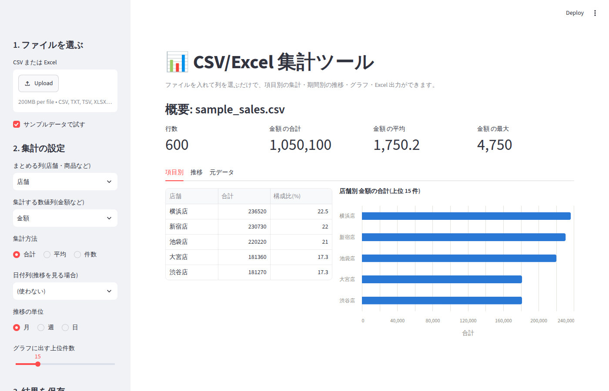
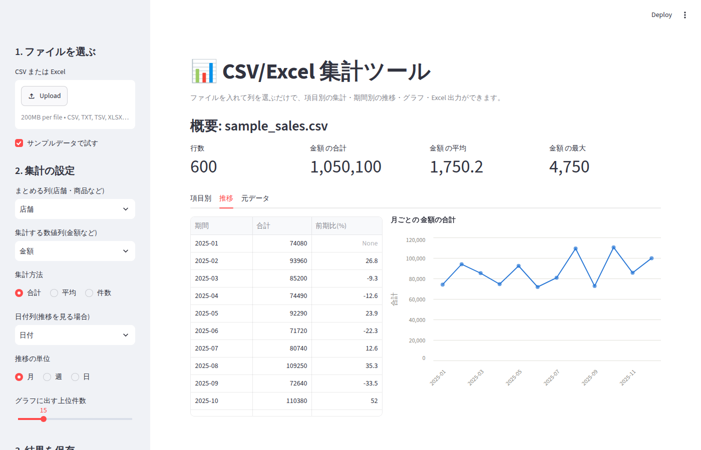

# csv-excel-summary(CSV/Excel 集計ツール)

CSV や Excel の売上・注文・作業記録などを **アップロードして列を選ぶだけ** で、
項目別の集計・月別の推移・グラフを表示し、結果を Excel でダウンロードできる業務ツールです。



## 目的

- 「Excel で毎回ピボットテーブルを作って集計している」作業を、ブラウザで数クリックにする
- Claude Code で開発し、生成されたコードは人が読んで直し、自動テスト(21 件)と Lint を通してから PR で取り込んでいる
- ポートフォリオ(応募時の成果物)として、要件整理 → 実装 → テスト → 文書化までを一通り揃える
- 依頼者の実データは使わず、ダミーデータ(`data/sample_sales.csv`)で開発・動作確認している

## できること

| 機能 | 内容 |
|------|------|
| ファイル読み込み | CSV(UTF-8 / Shift_JIS 自動判定、タブ区切りも可)、Excel(シート選択可) |
| 列の自動判定 | 数値列・文字列列・日付列を自動で見分け、選択肢に出す |
| 項目別集計 | 店舗・商品などでまとめて「合計 / 平均 / 件数」と構成比(%)を出す |
| 期間別推移 | 日付列から「月 / 週 / 日」ごとの推移と前期比(%)を出す(データがない月も 0 で埋める) |
| グラフ | 横棒グラフ(上位 N 件)と折れ線グラフ。マウスを乗せると値が出る |
| Excel 出力 | 「項目別集計」「期間別推移」「元データ」の 3 シート。見出し太字・列幅調整・先頭行固定 |
| コマンド実行 | 画面なしで `python -m src.main` からも同じ集計ができる(定期実行向け) |

## セットアップ

Python 3.11 以上が必要です。

```bash
cd csv-excel-summary
python -m venv .venv && source .venv/bin/activate   # Windows は .venv\Scripts\activate
pip install -r requirements.txt
```

## 使い方

### 画面で使う

```bash
streamlit run app/app.py
```

ブラウザが開いたら、左のサイドバーで次の順に操作します。

1. **ファイルを選ぶ**: 「Upload」から CSV / Excel を選ぶ。まず試すなら「サンプルデータで試す」にチェック
2. **集計の設定**: まとめる列(例: 店舗)、集計する数値列(例: 金額)、集計方法を選ぶ。
   推移を見たいときは日付列を選び、月 / 週 / 日を切り替える
3. **結果を保存**: 「Excel でダウンロード」を押すと集計結果が 1 ファイルで落ちてくる

画面の中央には、概要(行数・合計・平均・最大)と、「項目別」「推移」「元データ」の 3 つのタブが出ます。



### コマンドで使う(画面なし)

```bash
python -m src.main data/sample_sales.csv --group 店舗 --value 金額 --date 日付 --out 集計結果.xlsx
```

| 引数 | 意味 | 省略時 |
|------|------|--------|
| `file` | 入力ファイル(.csv / .xlsx) | 必須 |
| `--group` | まとめる列 | 必須 |
| `--value` | 集計する数値列 | 必須 |
| `--date` | 日付列(指定すると推移シートも出る) | なし |
| `--agg` | 合計 / 平均 / 件数 | 合計 |
| `--period` | 月 / 週 / 日 | 月 |
| `--sheet` | Excel のシート名 | 先頭シート |
| `--out` | 出力ファイル | summary.xlsx |

## 動作確認

```bash
./scripts/check.sh        # ruff(Lint)と pytest(テスト 21 件)をまとめて実行
python scripts/make_sample.py   # サンプルデータを作り直す(seed 固定で毎回同じ内容)
```

テストの内訳:

- `tests/test_loader.py`: UTF-8 / Shift_JIS の CSV、タブ区切り、複数シートの Excel、空ファイルのエラー
- `tests/test_analyzer.py`: 列の自動判定、項目別集計(未入力・文字列の数値も扱える)、月別推移と前期比
- `tests/test_exporter_charts.py`: Excel の書き出しと読み戻し、グラフ定義の生成
- `tests/test_main.py`: コマンド実行で 3 シートの Excel ができること
- `tests/test_app.py`: Streamlit の画面をブラウザなしで実行し、エラーなく表示・操作できること

## ファイル構成

```
csv-excel-summary/
├── app/app.py            # Streamlit の画面(操作の流れはここ)
├── src/
│   ├── loader.py         # CSV / Excel の読み込み(文字コード・シート対応)
│   ├── analyzer.py       # 集計ロジック(pandas だけで動く。テストの中心)
│   ├── charts.py         # グラフ(Altair。単色・ホバーで値表示)
│   ├── exporter.py       # Excel 出力(openpyxl で見出し・列幅を整える)
│   └── main.py           # コマンドラインの入口
├── scripts/
│   ├── check.sh          # Lint + テストを 1 コマンドで
│   └── make_sample.py    # ダミーデータ生成
├── data/sample_sales.*   # 動作確認用のダミー売上データ(600 行)
├── tests/                # pytest
└── docs/                 # スクリーンショット
```

## 設計のポイント(初心者向けメモ)

- **画面とロジックを分ける**: `app/app.py` は表示と入力の受け取りだけ。集計は `src/analyzer.py` にあり、
  画面を立ち上げなくてもテストできる。コマンド版(`src/main.py`)も同じ関数を呼んでいる。
- **文字コードは順番に試す**: Excel で保存した CSV は Shift_JIS のことが多いので、UTF-8 → cp932 の順に試す。
- **エラーは日本語で画面に出す**: 読み込み失敗は `LoadError` にまとめ、画面ではそのまま表示する。
- **グラフは Altair**: Streamlit に同梱されていて追加インストール不要。ブラウザで描くので日本語フォントの問題がなく、
  マウスを乗せると値が見える。系列が 1 つなので単色にし、目盛線は薄くして数字を読みやすくしている。

## 今後の拡張候補

- 2 つの列でまとめる(店舗 × 商品カテゴリ)クロス集計
- 複数ファイルをまとめて読み込む(月ごとのファイルを結合)
- 前年同月比、目標値との差分
- グラフ画像(PNG)の保存

## 納品時の説明(依頼者向け)

このツールは、お手元の CSV / Excel をブラウザ上で集計するものです。
データはお使いのパソコンの中だけで処理され、外部に送信されません。
「セットアップ」の 3 行を一度実行すれば、以後は `streamlit run app/app.py` だけで起動できます。
列の名前が変わっても、画面で選び直すだけで対応できます。
